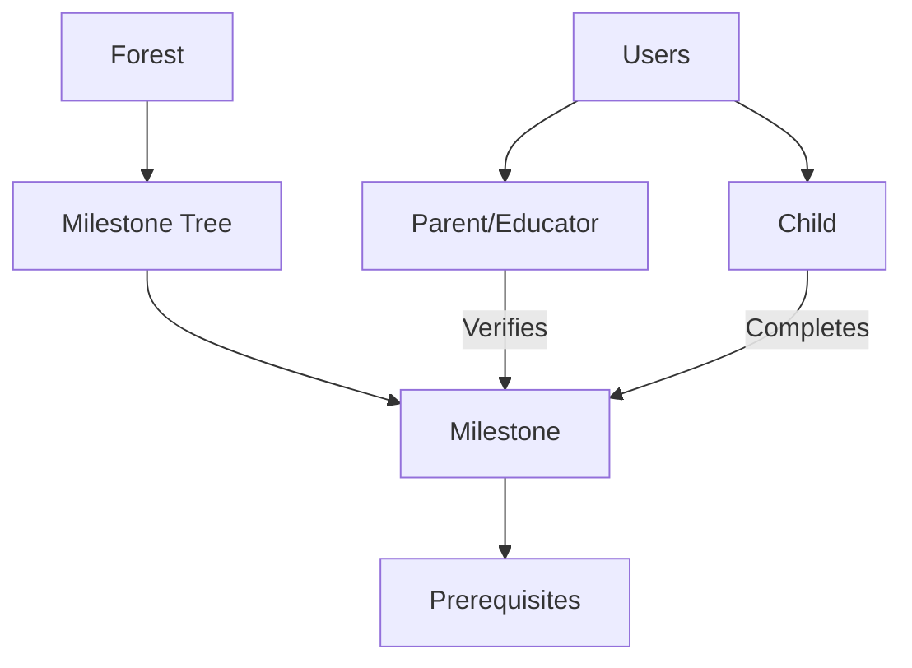

# Basic Learning Progress Tracker

A blockchain-powered educational achievement tracking system that provides transparent, immutable records of learning milestones.

## Overview

The Basic Learning Progress Tracker is a comprehensive platform designed to visualize and record educational achievements using blockchain technology. By creating structured, verifiable learning paths, this system empowers learners, educators, and parents to collaboratively track and validate educational progress.

### Key Features
- Custom learning paths and curriculum frameworks
- Visual milestone trees representing skills and knowledge
- Immutable verification of learning achievements
- Multi-stakeholder collaboration (parents, educators, children)
- Self-directed learning options for children
- Prerequisite-based progression system

## Architecture

The GrowPulse system is built around a core smart contract that manages users, relationships, and learning milestones organized in forest structures.



### Core Components
- **Users**: Four distinct roles (Admin, Educator, Parent, Child)
- **Forests**: Collections of related milestone trees (e.g., "Mathematics")
- **Milestones**: Individual learning achievements
- **Relationships**: Parent-child and educator-child connections
- **Completions**: Verified achievement records

## Contract Documentation

### growpulse-core.clar
The main contract managing the GrowPulse platform's functionality.

#### Key Maps
- `users`: Stores user information and roles
- `forests`: Defines collections of milestone trees
- `milestones`: Stores learning achievement definitions
- `milestone-completions`: Tracks verified completions
- `user-relationships`: Manages authorized relationships

#### Access Control
- Role-based access control (Admin, Educator, Parent, Child)
- Relationship-based permissions for milestone verification
- Self-completion capabilities for children

## Getting Started

### Prerequisites
- Clarinet
- Stacks blockchain wallet
- Development environment for Clarity

### Basic Usage

1. Register a user:
```clarity
(contract-call? .growpulse-core register-user "John Doe" u2) ;; Register as educator
```

2. Create a forest:
```clarity
(contract-call? .growpulse-core create-forest "Mathematics" "Core math skills")
```

3. Create a milestone:
```clarity
(contract-call? .growpulse-core create-milestone 
    "Addition Basics" 
    "Master basic addition" 
    "Math" 
    u1 
    u1 
    none)
```

## Function Reference

### User Management

```clarity
(register-user (name (string-ascii 100)) (role uint))
(create-relationship (child-id principal) (relationship-type (string-ascii 20)))
```

### Forest Management

```clarity
(create-forest (name (string-ascii 100)) (description (string-ascii 500)))
```

### Milestone Management

```clarity
(create-milestone (title (string-ascii 100)) 
                 (description (string-ascii 500))
                 (category (string-ascii 50))
                 (difficulty-level uint)
                 (forest-id uint)
                 (parent-milestone-id (optional uint)))

(complete-milestone (milestone-id uint) 
                   (child-id principal) 
                   (evidence-url (optional (string-utf8 500))))

(self-complete-milestone (milestone-id uint) 
                        (evidence-url (optional (string-utf8 500))))
```

## Development

### Testing
1. Clone the repository
2. Install Clarinet
3. Run `clarinet test` to execute test suite
4. Use `clarinet console` for interactive testing

### Local Development
1. Set up local Clarinet chain
2. Deploy contracts using `clarinet deploy`
3. Interact with contracts through the console or API

## Security Considerations

### Permissions and Access Control
- Only authorized users can verify milestones
- Parent/educator relationships must be established before managing children's progress
- Role-based access controls prevent unauthorized modifications

### Known Limitations
- Milestone prerequisites are immutable once set
- Self-completion by children cannot be automatically verified
- Evidence URLs must be maintained externally

### Best Practices
- Verify user relationships before granting access
- Include evidence when completing milestones
- Follow prerequisite patterns for structured learning paths
- Regularly audit completion records